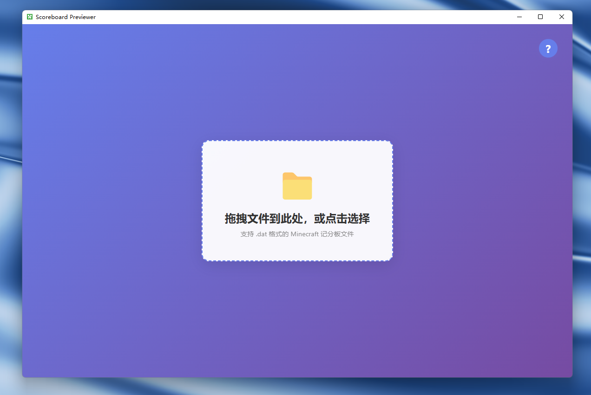

# Minecraft 记分板预览器

一个简单易用的桌面应用，用于预览 Minecraft 记分板（scoreboard.dat）。



## 快速开始

你可以选择以下任意方式使用：

### 1. 直接运行源码

```bash
# 克隆仓库
git clone https://github.com/jz0ojiang/ScoreboardPreviewer.git
cd ScoreboardPreviewer
# 安装依赖
pip install -r requirements.txt
# 启动
python app.py
```

### 2. 下载 Release

前往 [Releases](https://github.com/jz0ojiang/ScoreboardPreviewer/releases) 页面，下载适合你系统的可执行文件，解压后直接运行。

## 使用方法

- 打开应用后，**直接拖拽你的 scoreboard.dat 文件到页面中央**，或点击选择文件。
- 支持 .dat 格式的 Minecraft 记分板文件。

## scoreboard.dat 文件位置

- `.minecraft/versions/版本/saves/存档/data/scoreboard.dat`
- 或 `.minecraft/saves/存档/data/scoreboard.dat`

> ⚠️ 需在游戏存档已加载过记分板后查找此文件。

## 解析器

目前已测试过的版本：

- [x] 1.20.5
- [x] 1.19.2

如需支持其他版本，请在 [issues](https://github.com/jz0ojiang/ScoreboardPreviewer/issues) 中提出。

在 /example 下有测试用的 scoreboard.dat 文件，可以参考。

## LICENSE

本项目授权协议为**自定义非商用许可证**。

- 🚫 禁止原样二次分发和商用；
- ✅ 允许学习、运行和本地修改；
- ✅ 使用需注明原作者（jz0ojiang）；
- 📧 如需商用授权，请联系作者。

详情请查阅 [LICENSE](./LICENSE)。